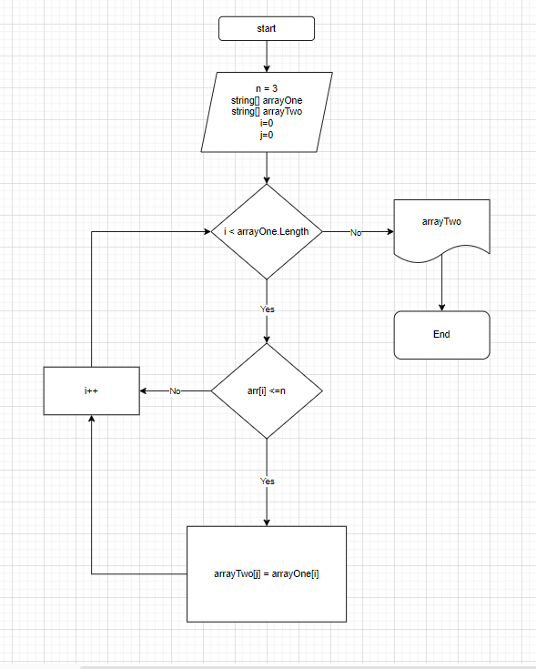

# FinalTask
## Задача : 
### Написать программу, которая из имеющегося массива строк формирует массив из строк, длина которых меньше либо равна 3 символа. Первоначальный массив можно ввести с клавиатуры, либо задать на старте выполнения алгоритма. При решение не рекомендуется пользоваться коллекциями, лучше обойтись исключительно массивами
**Примеры**:[“Hello”, “2”, “world”, “:-)”] → [“2”, “:-)”]
## Алгоритм решения:
1. Создал Массив из строк.
2. Метод заполнения массива *FillArray*
3. Метод вывода заполненного массива на экран *PrintArray*
4. Метод длинны массива *GetSecondArray*.
5. Условия окончания решения, когда второй массив = 0
6. Метод переноса элементов массива в новый *TansferOfElements* .
7. Вывод на экран нового массива.

# Блок-схема

